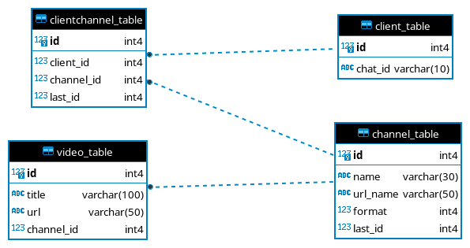

# Youtube Telegram Bot - API Worker

Backend application for [Youtube telegram Bot Frontend](https://github.com/devmontoya/youtube_telegram_bot_frontend), a new implementation of [youtube_telegram_bot_monolithic](https://github.com/devmontoya/youtube_telegram_bot_monolithic) using **docker**, **celery** and **FastAPI**.

This application and **"Youtube telegram Bot Frontend"** are currently in an incomplete state compared to its predecessor, but as it is proposed, it will allow a more **scalable** and **flexible** system.

## Project overview  (Backend and Frontend)

This project is a system that allows users to realize a follow-up of their favorite Youtube channels from Telegram without having to have a Youtube account or encounter videos that are not of interest to them. The system performs scraping on all channels frequently to update the data of latest videos. In addition, it keeps track of the videos already known by the users, which allows that in each request for new videos from all the channels of a user, the system delivers only those unknown to the user.

## Database Diagram

## How to use

- `docker-compose -f docker/Docker-compose.yml up --build`
